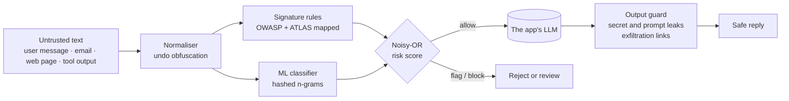

# CASSANDRA LLM Firewall

**An explainable prompt-injection firewall for LLM applications.**
It screens every piece of untrusted text before it reaches a language model, checks the model's answer
for leaks on the way out, and explains every verdict. An interactive explainer teaches the attack, and
a red-team arena lets visitors try to beat the firewall.


### [▶ Live demo: cassandra-llm-firewall.onrender.com](https://cassandra-llm-firewall.onrender.com)

<sub>Hosted on a free plan: the first visit after a quiet spell takes about a minute while the server wakes up.</sub>


> **This is a public case study.** The source code is in a private repository. This repo documents
> the architecture, security design, engineering decisions and screenshots of the working system.
> I can walk through the code live or grant temporary access for a formal review.

---

## At a glance

| | |
|---|---|
| **What** | A firewall for LLM apps that detects prompt injection in untrusted text, and leaks in model output, with an explanation for every decision |
| **Surfaces** | Web app (explainer, scanner, arena, model report), REST API, CLI, Python library, one Docker image |
| **Detection** | Anti-obfuscation normaliser · 15 signature rules mapped to OWASP LLM Top 10 and MITRE ATLAS · ML classifier · output leak guard |
| **Decision** | Explainable evidence scoring (noisy-OR) into `allow` / `flag` / `block` |
| **Results** | 99.4% precision, 98.4% recall, 1.7% false alarms on 2,933 held-out prompts; honest leave-one-dataset-out results alongside |
| **Speed** | About 1 ms per scan on a CPU; no GPU, no paid API, no text leaves the server |
| **Tests** | 144 backend tests on Python 3.11 and 3.12 (99% coverage), 23 frontend tests, a 35-step end-to-end browser check, container smoke tests in CI |
| **Role** | Independent portfolio project: research, design, ML, backend, frontend and DevOps |

## The problem

Every app that feeds untrusted text into a language model (email assistants, chatbots, RAG over web
pages, coding agents) can be hijacked by text that *looks like data but acts like instructions*.


The attacker never talks to the model. They hide an instruction in content the model will read later,
here a line of white-on-white text in a booking email, and wait. Language models have no separate
channel for data, so the instruction arrives looking exactly like the developer's own.

This is **prompt injection**, ranked #1 in the OWASP Top 10 for LLM Applications. There is no complete
fix, so it has to be defended in layers. CASSANDRA is one such layer.

## Architecture



| Component | Role |
|---|---|
| **Detection engine** | A Python package: normaliser, rules, classifier and output guard behind one `Firewall` object. The API, CLI and arena all call it, so a verdict is identical everywhere. |
| **HTTP API** | FastAPI service with single and batch scanning, output checks, the model card and the arena. Hardened with size limits, proxy-aware rate limiting and strict headers. |
| **CLI** | `cassandra scan` gates CI pipelines with exit codes; `cassandra serve` runs everything. |
| **Web app** | React + TypeScript: the interactive explainer, scanner, arena and model report, all driven by the live API. |
| **Training pipeline** | Reproducible training and evaluation from four pinned public datasets; writes the weights and a model card. |

Details: [Architecture](docs/ARCHITECTURE.md)

## How a scan works

| # | Step | What it does |
|---|---|---|
| 1 | **Normalise** | Strips zero-width characters, folds Cyrillic/Greek look-alike letters and leetspeak, and decodes hidden base64, hex and URL-encoded payloads |
| 2 | **Match rules** | Looks for known techniques; each match records the exact span, a severity, and OWASP/ATLAS IDs |
| 3 | **Classify** | Scores the text with a model trained on ~20k labelled prompts, calibrated so 0.5 is its tuned threshold |
| 4 | **Decide** | Combines both layers into one risk; `allow` < 0.50 ≤ `flag` < 0.85 ≤ `block` |
| 5 | **Guard the output** | After the model answers, checks the reply for leaked secrets (plain, reversed, spaced out, encoded or partial), echoed system prompts and exfiltration links |


## Detection and risk scoring

The two detection layers fail differently, which is the point:

| | Signature rules | ML classifier |
|---|---|---|
| Precision | 99.8% | 99.5% |
| Recall | 25.6% | 98.3% |
| Explains which technique | Yes | No |
| Catches paraphrases | No | Yes |

They are combined as independent evidence with a noisy-OR:

```
risk = 1 − (1 − rules) × (1 − classifier)
```

Either layer alone can raise the alarm, agreement pushes the risk towards 1, and every verdict stays
explainable. Rule severities combine the same way, so several medium findings add up to a block.

Details: [Security design](docs/SECURITY_DESIGN.md)

## Results, honestly

On 2,933 held-out prompts, stratified by source and label, with the threshold tuned on a separate
validation split:

| Layer | Precision | Recall | F1 | False-positive rate |
|---|---:|---:|---:|---:|
| Rules only | 99.8% | 25.6% | 40.7% | 0.1% |
| Classifier only | 99.5% | 98.3% | 98.9% | 1.4% |
| **Rules + classifier** | **99.4%** | **98.4%** | **98.9%** | **1.7%** |

In-distribution scores flatter every model, so I also report **leave-one-dataset-out** results:
retrain without one dataset, then test only on it.

| Unseen dataset | Recall | False-positive rate | What it shows |
|---|---:|---:|---|
| Lakera Gandalf | 94.3% | 0.0% | Classic "ignore your instructions" attacks transfer well |
| SPML | 64.5% | 2.0% | Domain-specific chatbot attacks are harder |
| deepset | 32.7% | 1.5% | This dataset labels ordinary requests as attacks: a different definition |
| jailbreak-classification | 98.3% | 74.3% | Without benign role-play examples, the model flags all role-play. Hard negatives matter |


The explainer shows a real miss on purpose: a prompt that slips past both layers. It is the honest
argument for checking the model's output too.

## Screenshots

### Landing page
A true-black product page: a hero that types real attacks into a live scanner card, the model's
headline numbers, what the engine does, copyable integration code, and a call to try the arena.


### Interactive explainer
A five-part story with live demos: the hidden email, a diagram of trusted and untrusted text merging
into one context, the animated pipeline, the two-layer comparison and the model's real metrics.


### Scanner
Verdict, per-layer scores, the obfuscation that was removed, the highlighted evidence and every
matched technique with its OWASP and ATLAS IDs. One-click example attacks and a session log.


### Red-team arena
A guardian holds a password behind four gates of increasingly strong defences. Blocked messages say
exactly why.


<details>
<summary><b>More screenshots</b>: model report, a decoded attack, light theme, mobile</summary>

### Model report
Metrics per layer, confusion matrix, generalisation results, training data and limitations, read
live from the shipped model card.


### An attack hidden in base64
The scanner decodes the payload, finds the instruction override inside it, and says where it came from.


### The context diagram
Three sources with three trust levels arrive at the model as one stream of tokens.


### Light theme
Black is the default; one click in the header switches to a warm light theme, remembered per browser.


### Mobile

| Landing | Scanner verdict |
|---|---|
|  |  |

</details>

A full page-by-page walkthrough is in the [Product tour](docs/PRODUCT_TOUR.md).

## Engineering highlights

- **One engine, many surfaces.** The API, CLI, arena and Python library call the same `Firewall`
  object, so a verdict cannot differ between them.
- **The UI never contradicts the model.** Every number and verdict on screen comes from the live API or
  the shipped model card; explanatory text in the explainer is derived from the live scores.
- **No pickle.** Model weights ship as plain arrays loaded with `allow_pickle=False`; loading a pickled
  model is a well-known remote-code-execution vector.
- **Bounded work per request.** Bodies are capped before buffering (including chunked uploads), and
  every rule is fuzz-tested against catastrophic regex backtracking.
- **Spoof-resistant rate limiting.** The client address comes from the proxy-appended end of
  `X-Forwarded-For`, counting only configured trusted hops, never the client-written start.
- **Batch scanning for RAG.** Retrieved documents are scored in one classifier pass: 2.7× faster than
  one by one on 20 documents, before counting saved round-trips.
- **Reproducible ML.** Datasets pinned to exact revisions and fixed seeds; retraining reproduces the
  shipped weights byte for byte.
- **Supply chain.** Lockfiles, GitHub Actions pinned to commit SHAs, `pip-audit`/`npm audit`, CodeQL,
  Dependabot, and SBOM plus provenance on released images.
- **Private source, public demo.** Render builds the Docker image straight from the private
  repository, so the live site never requires publishing the code.
- **Accessible by default.** Status colours validated for colour-vision deficiency and never used
  alone; keyboard navigation; every animation disabled under reduced-motion settings.

## What I cut, and why

| Removed or replaced | Reason |
|---|---|
| A dark "security console" dashboard | It looked like a generic template and explained nothing. Replaced by an interactive explainer that teaches the attack with live demos, and later a product landing page in a deliberate true-black design. |
| Hugging Face Spaces hosting | A public Space exposes its source. Replaced by Render, which builds from the private repository. |
| Trusting the first `X-Forwarded-For` entry | That entry is written by the client, so anyone could dodge rate limits. Replaced by counting trusted proxy hops from the right. |
| One rate-limit bucket behind a hosting proxy | Every visitor looked like the same IP. The deploy now declares its proxy hop. |
| A transformer classifier | Would need a GPU or paid API, and the generalisation gap is a data problem a bigger model would inherit. The engine keeps a swappable interface instead. |
| Pickled model files | Remote-code-execution risk on load. |
| A floating CI action tag | It did not exist and broke CI. Every action is now pinned to a commit. |
| Dead code found in a final audit | An always-true health field, unused normaliser fields, hand-written API converters, an unused error class. |

More on these decisions: [Design decisions & Q&A](docs/DESIGN_DECISIONS.md)

## Tech stack

| Area | Tools |
|---|---|
| Engine & API | Python 3.11, FastAPI, Pydantic, Uvicorn |
| ML | scikit-learn (logistic regression on hashed n-grams), NumPy, SciPy; datasets: deepset, jailbreak-classification, SPML, Lakera Gandalf |
| Frontend | React 19, TypeScript 7 (strict), Vite, CSS modules, Lucide icons, self-hosted Source Serif 4 and IBM Plex |
| Quality | pytest, mypy `--strict`, ruff, Vitest, Testing Library, oxlint, Prettier, Playwright |
| Delivery | Docker (multi-stage, non-root, read-only), Docker Compose, GitHub Actions, GitHub Container Registry, Render |
| Security | OWASP LLM Top 10, MITRE ATLAS, CodeQL, pip-audit, npm audit, Dependabot |

## Known limitations

- It is one layer, not a guarantee. A determined attacker can phrase an injection no filter
  recognises; it should be paired with least-privilege tools and human confirmation.
- Mostly English. Other languages are covered only by a few rules.
- The arena's guardian is simulated, so the demo stays free and deterministic.
- Rate limiting and arena state live in process memory, so the service runs as one worker. Scaling out
  would need a shared store such as Redis.

## Documentation

Not sure where to start? The [documentation index](docs/README.md) suggests a reading path for
recruiters, engineers, security reviewers and data scientists.

| Document | Contents |
|---|---|
| [Product tour](docs/PRODUCT_TOUR.md) | Every page and feature, with screenshots |
| [Architecture](docs/ARCHITECTURE.md) | Components, request flow, HTTP pipeline, engine internals, frontend, deployment, scaling |
| [Detection engine](docs/DETECTION_ENGINE.md) | Normalisation, the full rule catalogue, the classifier, worked scoring examples, the output guard |
| [Model and evaluation](docs/ML_EVALUATION.md) | Data, training, tuning, every metric, generalisation, error analysis, reproducibility |
| [Security design](docs/SECURITY_DESIGN.md) | Threat model for protected apps and for CASSANDRA itself, controls, hardening roadmap |
| [Interfaces](docs/INTERFACES.md) | The HTTP API with real requests and responses, the CLI, the Python library, configuration |
| [UI and UX design](docs/UI_UX_DESIGN.md) | Research and inspiration, the true-black theme, the design system, colour validation, motion, accessibility |
| [Testing and quality](docs/TESTING_AND_QUALITY.md) | Test suites per module, end-to-end checks, fuzzing, benchmarks, CI/CD |
| [Deployment and operations](docs/DEPLOYMENT.md) | The container, hardened Compose, the Render live demo, releases, operations |
| [Design decisions & Q&A](docs/DESIGN_DECISIONS.md) | Trade-offs, what changed during the build, answers to common questions |
| [Demo walkthrough](docs/DEMO_WALKTHROUGH.md) | The 10-minute demo script I use for reviews |
| [Roadmap and limitations](docs/ROADMAP.md) | Known limits and what comes next |
| [Glossary](docs/GLOSSARY.md) | Every term, in plain language |

## Source code availability

The implementation is private because it contains the detection rules, training pipeline and
deployment details, which would help an attacker tune bypasses more than they would help a reviewer.
For interviews or formal review I can share my screen and walk through the code, or grant temporary
read access.

---

© 2026 zeinitsu03. All rights reserved — see [LICENSE](LICENSE).
