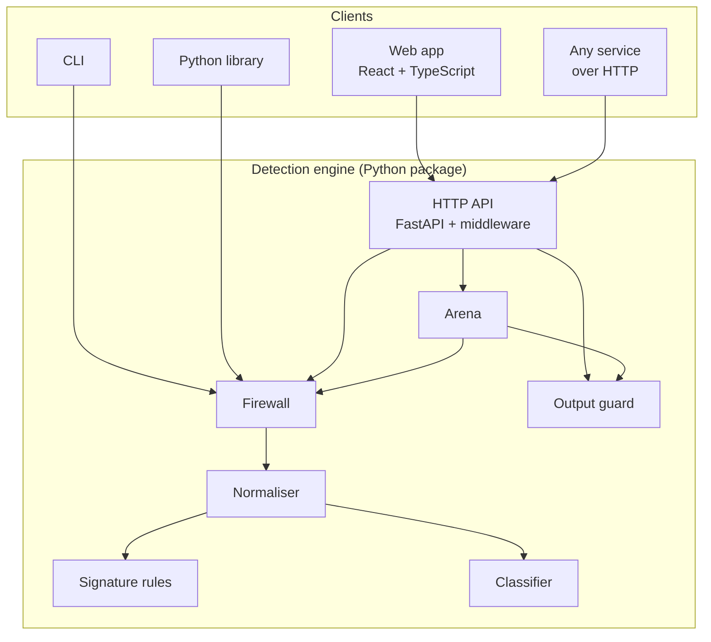
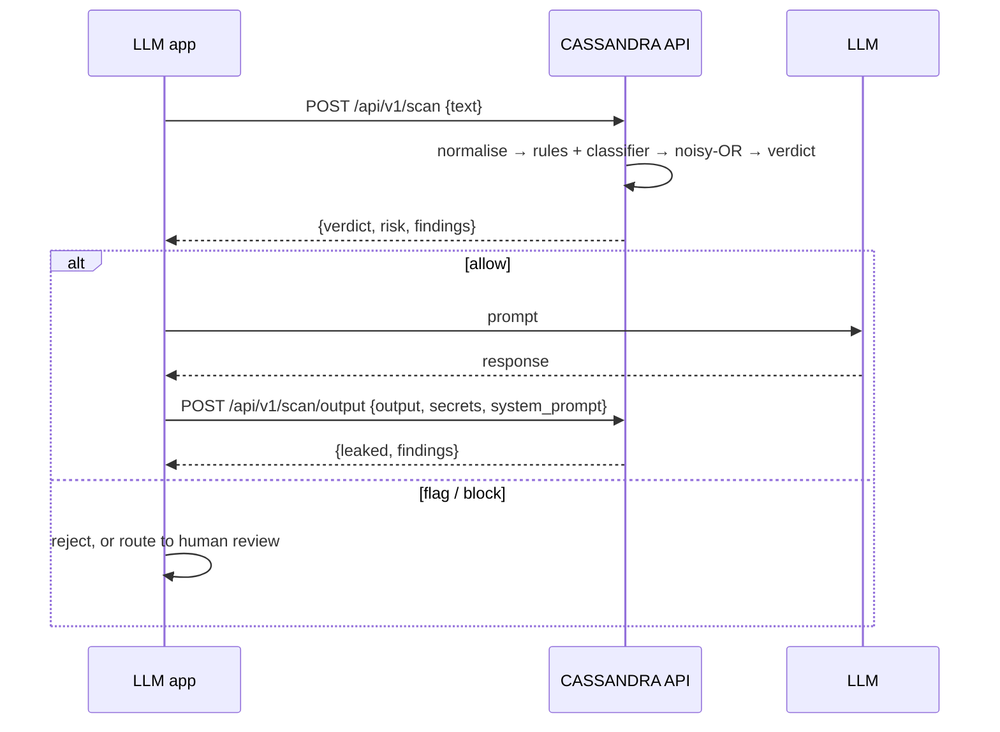

# Architecture

How CASSANDRA is put together, and why each piece sits where it does.

## Components

| Component | Responsibility |
|---|---|
| **Normaliser** | Unicode normalisation, invisible-character removal, look-alike and leetspeak folding, decoding of hidden base64/hex/URL payloads |
| **Signature rules** | 15 rules for known techniques, each with a severity and OWASP LLM Top 10 / MITRE ATLAS IDs |
| **Classifier** | Logistic regression over hashed word and character n-grams; pickle-free weights |
| **Firewall** | Runs both layers (singly or in batches), calibrates and combines the scores, picks the verdict |
| **Output guard** | Checks model responses for leaked secrets, echoed system prompts and exfiltration links |
| **Arena** | Four levels of defences in front of a simulated guardian that holds a password |
| **HTTP API** | Routes, input and body limits, rate limiting, security headers, serving the built web app |
| **CLI** | `scan` (with CI-friendly exit codes) and `serve` |

The key design choice: **everything goes through one `Firewall` object.** The API, CLI, arena and
library are thin layers over it, so a verdict cannot differ depending on where it was requested.

## Request flow

For RAG, `POST /api/v1/scan/batch` scores up to 32 retrieved documents in one classifier pass.

## HTTP pipeline

Requests pass through, in order:

| # | Stage | If it fails |
|---|---|---|
| 1 | **Body-size limit**: rejects oversized bodies before they are buffered, including chunked uploads | 413 |
| 2 | **Compression** for larger responses | — |
| 3 | **CORS**, only if configured | — |
| 4 | **Rate limit** on scan and arena requests, per client | 429 + `Retry-After` |
| 5 | **Validation**: types, lengths, batch size | 422 / 413 |
| 6 | **Engine** | — |
| 7 | **Security and cache headers** on every response | — |

## Engine internals

- **Spans stay valid through normalisation.** Length-changing steps run first and produce the
  canonical text; every later fold maps one character to one character, so a match in any variant is
  a valid span in the canonical text the UI highlights.
- **Calibration.** The classifier's probability is rescaled so its tuned threshold sits at 0.5, putting
  both layers on the same scale before they are combined.
- **Batching.** Normalisation and rules run per text; the classifier scores the whole batch in one
  matrix operation.
- **Stateless features.** Hashed features need no vocabulary, so the model is two arrays and a small
  config file, and the feature extractors are built once per model.

## Frontend

| Area | Approach |
|---|---|
| Structure | Pages (explainer, scanner, arena, report), explainer sections with live demos, a small set of shared components, and tiny hooks for fetching, routing and scroll-triggered motion |
| Styling | CSS modules co-located with each component, one token file for light and dark themes; no CSS framework, under 9 KB gzipped |
| Data | Typed API client mirroring the backend's schemas; nothing on screen is hard-coded |
| Motion | CSS transitions only; sections animate once when scrolled into view; all motion disabled under reduced-motion settings |
| Dependencies | React and self-hosted fonts at runtime; no router, state or component library |

## Deployment

| Target | How |
|---|---|
| Local | One command builds the UI and serves UI and API together |
| Docker | Multi-stage image, non-root user, health check; ~615 MB, ~100 MB RAM idle |
| Compose | Read-only root filesystem, all Linux capabilities dropped, `no-new-privileges` |
| Hugging Face Spaces | Deployed automatically after CI passes; the workflow declares the platform's proxy hop |
| Releases | Version tags publish an image to GitHub Container Registry with SBOM and build provenance |

## CI/CD

Every pull request runs lint and format checks, strict type checks (mypy, tsc), backend tests on Python
3.11 and 3.12 and frontend tests with an enforced coverage floor, dependency audits, and a Docker build
with smoke tests. CodeQL scans the code. All third-party actions are pinned to commit SHAs. Details:
[Testing and quality](TESTING_AND_QUALITY.md).

## Scaling limits

Rate-limit windows and arena passwords live in process memory, so the service runs as one worker. At
about a millisecond per scan, one worker served about 260 scan requests per second over HTTP in a
local test on 4 CPU cores, which is ample for the intended use. Scaling out would move that state to a shared store such as Redis.
