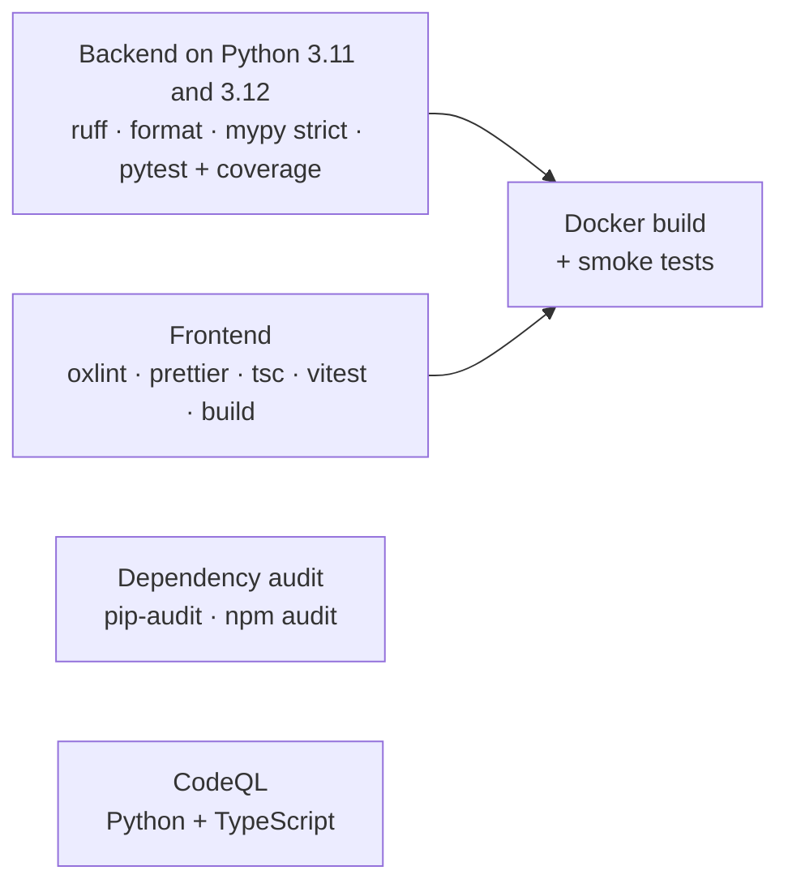

# Testing and quality

How CASSANDRA is verified, from single functions to the running container, and the automated gates
every change has to pass.

## Summary

| Layer | What | Result |
|---|---|---|
| Backend unit and integration tests | pytest, 144 tests | All pass · 99% branch coverage (≥ 90% enforced) |
| Frontend component tests | Vitest + Testing Library, 23 tests | All pass |
| End-to-end browser check | 35 scripted steps through every page in a real browser | 35 / 35 pass, no console errors |
| Container check | The production image run with the hardened Compose settings | Healthy; all smoke checks pass |
| Static analysis | ruff (incl. security rules), mypy `--strict`, oxlint, tsc strict, Prettier | Clean |
| Reproducibility | Full retraining run | Weights reproduced byte for byte |

## Backend tests (144)

| Module under test | Tests | What they cover |
|---|---:|---|
| Signature rules | 41 | Every rule on attack examples; benign look-alikes; obfuscated and base64-hidden attacks; span accuracy; framework mapping; noisy-OR scoring; ReDoS fuzzing on 10 adversarial inputs |
| HTTP API | 27 | Every endpoint; validation and size limits; batch scanning; rate limiting and proxy-spoofing resistance; streamed oversized bodies; security, cache and compression headers; CORS; static serving and path traversal; settings parsing and invalid values |
| Arena | 19 | The guardian's behaviour for each trick; each level's defences; output redaction; winnable levels; constant-time guesses |
| Output guard | 12 | Plain, spaced, reversed, base64, hex and partial secret leaks; short secrets; system-prompt echo; exfiltration links |
| Normaliser | 10 | Invisible characters, homoglyphs, full-width text, leetspeak, base64/hex/URL payloads, non-text blobs |
| Engine | 10 | Verdicts, rules-only and classifier-only modes, calibration, combination, batch results identical to single scans |
| CLI | 9 | Verdict output, stdin, JSON, `--fail-on`, exit codes for detections vs. usage errors, colour on terminals only, `serve`, the module entry point |
| Middleware | 9 | Client identification for every proxy-hop case; per-path headers; lifecycle events |
| Classifier | 5 | Pickle-free loading; separating attacks from benign text; save/load round trip; shape validation; model card consistency |
| Rate limiter | 2 | Sliding window and recovery; bounded memory |

## Frontend tests (20)

| Area | Tests | What they cover |
|---|---:|---|
| Scanner page | 3 | Scan and explanation, including the screen-reader announcement; one-click examples and the session log; API errors |
| Arena page | 3 | Locked gates unlocking; persistence; explaining blocked messages; starter prompts |
| Explainer demos | 3 | Email reveal and protection toggle; the full pipeline (in reduced-motion mode); outcome sentences derived from live scores |
| Report page | 1 | Headline metrics, confusion matrix, generalisation table, limitations |
| Utilities | 10 | Highlight segmentation with overlapping spans; revealing hidden characters; formatting; verdict thresholds matching the backend |

Tests find elements by role and accessible name, as a screen reader would, so they also guard
accessibility.

## End-to-end browser check (35 steps)

A scripted run in Chromium against the real server, covering:

- **Explainer:** navigation and API status; revealing the hidden email line; the hijacked summary; the
  protection toggle blocking via the API; the context diagram animation; the pipeline autoplaying all four
  stages; each of the four other presets; custom text; the three live layer cards; the live metrics; the
  call-to-action links.
- **Arena:** starter prompts; a leak at gate 1 with the typing indicator; rejecting a wrong password;
  unlocking gate 2; a blocked message with its reason; progress surviving a reload; resetting progress.
- **Scanner:** all six examples; a benign verdict; `Ctrl + Enter`; the session log count and restore; Copy
  JSON producing valid API output; the scoring explanation.
- **Report and routing:** stats, tables and datasets; the API docs route; an unknown route falling back to
  the explainer.

Result: 35 of 35 passed, with no browser console errors, plus no horizontal overflow on any page at
390 pixels wide.

## Security-focused testing

- **ReDoS fuzzing.** Every rule runs on 10 adversarial 8,000-character inputs (long repetitions,
  unterminated delimiters, near-miss keywords) and must finish in under 0.5 s.
- **Spoofing.** Tests prove a client-supplied `X-Forwarded-For` prefix can't change the rate-limit
  identity.
- **Resource limits.** Oversized bodies are rejected whether declared up front or streamed in chunks.
- **Path traversal.** Requests for files outside the web app's directory fall back to the app.
- **No pickle.** A test proves the model loads with pickle disabled.

## Performance

| Measurement | Result | Setup |
|---|---|---|
| Scan latency, in process | p50 0.86 ms · p95 1.65 ms | 900 scans of short and long texts, 4-core CPU |
| Batch vs. single classification | 8.8 ms vs. 23.7 ms for 20 documents (2.7×) | same machine |
| Throughput over HTTP | ≈ 260 requests/s | one worker, 16 concurrent clients |
| Container memory | ≈ 100 MB at idle | production image |
| Web app bundle | 84 KB JavaScript + 9 KB CSS, gzipped | production build |

## Continuous integration

Every pull request runs:

- The backend runs on every supported Python version (3.11 and 3.12). This matrix was added after CI
  caught a real problem: on 3.12 the lockfile resolves a newer NumPy whose type stubs the checker,
  pinned to 3.11, could not parse. The checker now targets the interpreter it runs under.
- The Docker job starts the real image and checks health, a blocked attack, and that the UI is served.
- Every third-party GitHub Action is pinned to a commit SHA, so a moved tag can't inject code.
- Dependabot groups minor and patch updates weekly and opens major upgrades one at a time.
- Tagging a version publishes a container image with an SBOM and build provenance.

## Code quality

- **Strict typing everywhere:** `mypy --strict` on the backend; `strict` and `noUncheckedIndexedAccess`
  TypeScript on the frontend.
- **Linting includes security rules** (ruff's bandit set): hard-coded secrets, unsafe subprocess calls,
  insecure deserialisation.
- **A final audit** removed dead code (an always-true health field, unused fields, hand-written
  converters, an unused error class), added batch scanning, and fixed every issue it found before
  release.
